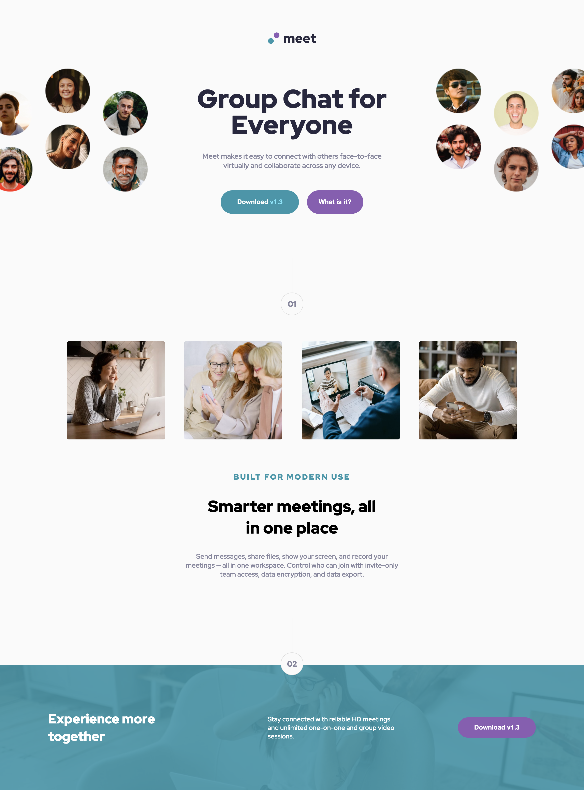

# Frontend Mentor - Meet landing page solution

This is a solution to the [Meet landing page challenge on Frontend Mentor](https://www.frontendmentor.io/challenges/meet-landing-page-rbTDS6OUR). Frontend Mentor challenges help you improve your coding skills by building realistic projects. 

## Table of contents

- [Overview](#overview)
  - [The challenge](#the-challenge)
  - [Screenshot](#screenshot)
  - [Links](#links)
- [My process](#my-process)
  - [Built with](#built-with)
  - [What I learned](#what-i-learned)
  - [Continued development](#continued-development)
  - [Useful resources](#useful-resources)
- [Author](#author)

## Overview

### The challenge

Users should be able to:

- View the optimal layout depending on their device's screen size
- See hover states for interactive elements

### Screenshot




### Links

- Solution URL: [Solution](https://github.com/andyjv1/Meet-Landing-Page-Master.git)
- Live Site URL: [Live](https://andyjv1.github.io/Meet-Landing-Page-Master/)

## My process

### Built with

- Semantic HTML5 markup
- CSS custom properties
- Flexbox
- CSS Grid
- Mobile-first workflow
- Visual Studio Code

### What I learned

This project was an excellent excercise to pratice making a real landing page.

```css
.section2{
  background-image: url("./starter-code/assets/desktop/image-footer.jpg"), linear-gradient(hsl(192, 54%, 64%), hsl(192, 54%, 64%));
}
```

### Continued development

I would like to focus on more complex web pages to learn more skills

### Useful resources

- [CSS background-image Property](https://www.w3schools.com/cssref/pr_background-image.php) - Help me put an image as a background-image.

## Author

- Frontend Mentor - [@andyjv1](https://www.frontendmentor.io/profile/andyjv1)

